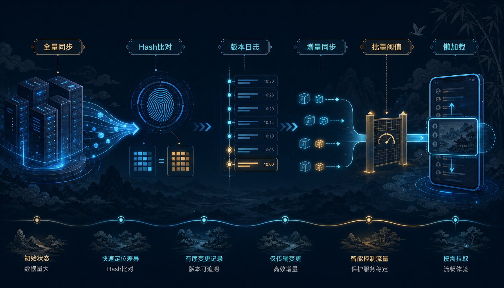
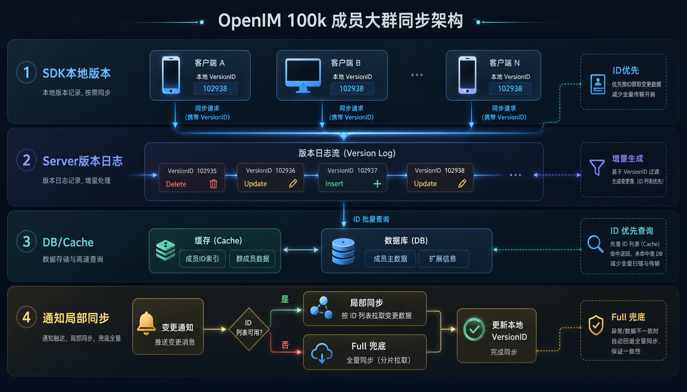

# OpenIM 如何保证10万人大群客户端数据和服务器的一致性

如果一个 IM 系统只面对普通群，群成员同步通常不算难题：断线后补一次数据，本地做一次差异更新，问题就过去了。

但当群规模上升到万人、十万人级别，事情就完全变了。群成员同步不再只是一个客户端功能，而会同时影响服务器压力、数据库写入、本地存储占用、网络请求峰值和 UI 刷新节奏。

OpenIM 对这件事做的不是“小修小补”，而是一次很彻底的大改：**不再把“同步全部成员”当默认动作，而是把同步拆成判断、增量、兜底、批量和懒加载五层**。

## 01. 先别急着同步，先判断这次值不值得同步

早期的大群同步思路很直接：先把群成员都拿回来，再和本地做对比，最后更新本地数据。

这个做法在小群里没问题，但到了大群场景，代价很快放大：群越大，搬运的数据越多；群越活跃，触发同步的频率越高；用户越多，服务端就越容易被同一类请求反复冲击。

所以 OpenIM 的第一步，不是让同步跑得更快，而是先让系统学会判断：**这次到底有没有必要同步**。

它先用一层轻量的集合摘要去判断成员是否真的发生变化。摘要一致，就说明这次没必要把完整成员列表再传一遍；摘要不一致，才进入后续流程。这个改动的意义很大，因为它把同步成本从“搬一大堆数据”降成了“先做一次轻比较”。

但摘要方案只能拦住“没变化”的请求，挡不住高频变化的大群。群里如果经常有人进出、禁言、改角色、改资料，摘要就会频繁失效。所以摘要不是终点，它只是第一道闸门。

## 02. 继续瘦身：把“整个群”改成“版本差异”

真正的变化，发生在第二步。

OpenIM 把群成员同步从“全量拉取”改成了“版本驱动的增量同步”。也就是说，系统不再关心“这个群里全部有哪些成员”，而是关心“从上一次同步到现在，发生了哪些变化”。

这样一来，同步对象就被重新定义了：

- 删除了谁；
- 新增了谁；
- 谁的资料变了；
- 谁的权限或排序变了；
- 什么时候必须直接切到兜底模式。

这个改法的本质，是把同步从“整群重建”变成“版本差分”。客户端只需要记住自己已经同步到哪一版，下一次只看这一版之后的变化即可。服务端也不再每次返回整堆成员，而是按版本差异给出最小更新集。

这一步之后，大群同步才真正进入增量时代。

## 03. Full 不再是默认动作，而是最后的安全兜底

很多系统做增量同步时，最怕的就是为了追求增量，把一致性搞丢。

OpenIM 没有这样做。它保留了一个完整兜底：如果版本链不连续、版本锚点对不上，或者系统判断差异过大，就不再硬做增量，而是切回完整恢复路径。

但这里的“完整恢复”也不是老式意义上的全量重拉。它更像是一次重新对齐：先恢复当前正确状态，再把后续增量链重新接上。也就是说，Full 不是回到老路，而是让系统在异常情况下重新站稳。

这一步很关键。因为大群同步里最怕的不是“慢一点”，而是“慢一点还不准”。OpenIM 的思路很明确：**增量是主路，Full 只是安全带**。

## 04. 人多群多的时候，必须做批量收口

另一个大问题是“一个人有很多群”。

典型场景比如客服、运营、机器人账号，登录后会同时面对大量群同步请求。如果每个群都单独做版本比对，很容易把系统瞬间打满。

OpenIM 的处理方式是：把同步请求做批量收口，把返回结果做阈值控制。请求数量不能无限增长，服务端返回的变化量也不能无限增长。只要累计变化达到一个上限，就先停下来，下一批再做。

这件事看起来只是“分批处理”，但本质上它是把同步从无边界操作变成了有边界窗口：

- 请求不会无限堆积；
- 服务端不会被一个用户拖出雪崩效应；
- 客户端也不会一次把太多数据压进内存。

这一步解决的是“规模放大后怎么不失控”。

## 05. 同步时机后移：让用户真的用到，再去补数据

最浪费的同步，不是同步慢，而是同步了用户根本没打开的东西。

OpenIM 后面做的一个很重要的大改，就是把群同步的时机往后挪。它不再要求用户一上线就把所有群成员都同步完，而是把同步挂到会话生命周期里：先保证用户能进入系统，再在真正进入相关会话时，把对应群的信息慢慢补齐。

这个改法的收益非常直接：

- 断线重连后的同步高峰被摊平了；
- 用户暂时不关心的群，不再抢第一波资源；
- 群同步从“统一爆发”变成“按访问路径逐步展开”。

这就是典型的懒加载思路。不是不同步，而是把同步延后到真正有价值的时候。

## 06. 通知能直接带变化，就不要再重复比一次

大群里的很多变化，本来就是通过通知到达客户端的。

比如成员进群、退群、被踢、角色变化、群资料变化、禁言状态变化，这些信息已经足够说明“哪里变了”。OpenIM 没有浪费这些通知，而是把它们直接转成局部同步动作，交给统一的同步框架落地。

这样做有两个好处：

1. 重复请求少了，不需要明明已经知道变化，还再去问一次；
2. 落库逻辑统一了，不管是主动拉取还是通知触发，最后都走同一条更新链路。

为了避免短时间重复处理，系统还会对群同步动作做串行化和去重。这个细节看起来不显眼，但在大群高频通知场景里，能明显减少抖动。

## 07. 真正省下来的，不只是流量，还有内存

很多人看同步优化，第一眼只看网络流量，但大群场景里，内存同样是大头。

旧思路的问题在于：为了判断有没有变化，客户端往往要先把本地大批成员对象加载出来，再和服务端结果做比较。群一大，这个过程本身就很重。

OpenIM 的大改，是把顺序反过来：

先比较版本和摘要，再判断是否有差量；
只有确定有变化，才加载真正需要更新的那部分数据。

这样一来，系统比较的是“变化标识”，而不是完整对象。结果就是：少读、少比、少分配、少触发，客户端和服务端都轻很多。

## 08. 不是必须拥有全部详情，才能做好搜索和展示

大群同步还有一个现实问题：如果本地不保存全部群成员详情，搜索会不会不完整？

OpenIM 的做法不是强行二选一，而是把这个问题拆开：

- 如果业务更重视本地完整搜索，就可以多同步一些成员信息；
- 如果业务更重视启动速度和服务器压力，就可以只同步必要信息；
- 如果业务希望两者兼顾，也可以把搜索能力部分放到服务端。

也就是说，它没有把“本地必须存下全部内容”当成唯一解，而是给业务留了空间。群列表、群详情、按需获取、补齐信息，这些能力组合起来，既能支撑大群体验，也不会把本地撑爆。

## 09. 这次大改的本质：把同步拆成五个判断

OpenIM 最终不是靠一个技巧解决大群同步，而是把它拆成了五个问题：

| 问题      | 处理方式               |
|---------|--------------------|
| 要不要同步   | 先判断摘要和版本是否变化       |
| 同步什么    | 只同步差异，不同步整群        |
| 同步多少    | 批量化、设上限、分窗口处理      |
| 什么时候同步  | 跟随会话生命周期，按需懒加载     |
| 同步失败怎么办 | Full 作为兜底，重新对齐当前状态 |

这五层合起来，才是这次大改的核心。

## 结语

OpenIM 这次群成员同步的大改，核心不是“更快地同步更多”，而是“更克制地同步更少”。

它把全量同步改成了摘要判断，把摘要判断改成了版本差分，把版本差分改成了批量和阈值，把统一爆发改成了懒加载，把重复比对改成了通知驱动的局部更新。最终的结果就是：服务器压力更小，客户端更轻，本地恢复更快，大群场景也更稳。
