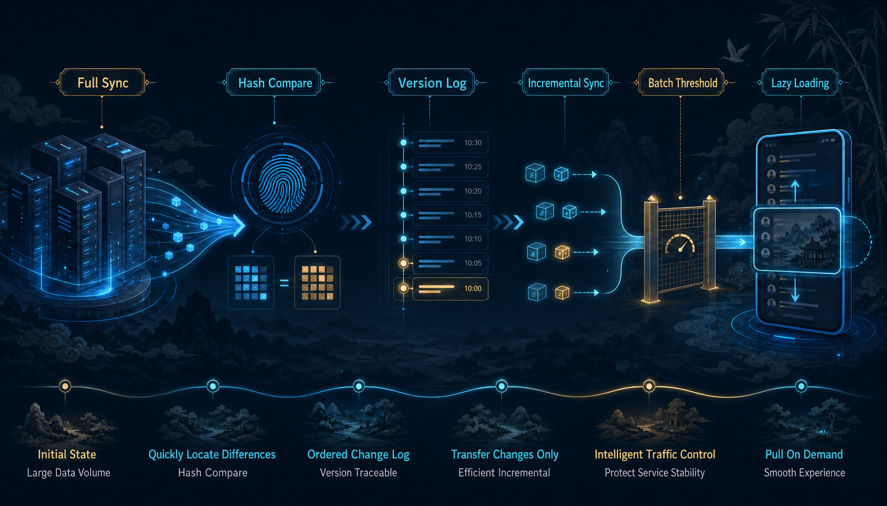
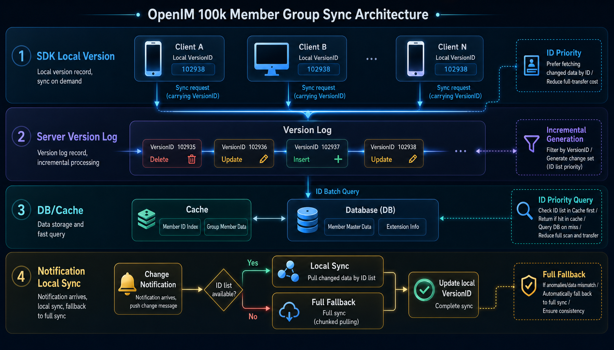

# How OpenIM Ensures Client-Server Data Consistency in 100,000-Member Groups

If an IM system only needs to support ordinary groups, group member synchronization is usually not a hard problem: after a reconnect, pull the missing data, apply a local diff, and move on.

But once a group grows to tens of thousands or even 100,000 members, everything changes. Group member synchronization is no longer just a client-side feature. It directly affects server pressure, database writes, local storage usage, request spikes, and UI refresh cadence.

OpenIM did not treat this as a small optimization. It made a much deeper redesign: **instead of treating “sync all members” as the default action, OpenIM split synchronization into five layers: judgment, incrementality, fallback, batching, and lazy loading**.

## 01. Do Not Sync Immediately. First Decide Whether This Sync Is Worth It

The early approach to large-group synchronization was straightforward: fetch all group members first, compare them with local data, and then update the local store.

This works for small groups, but the cost quickly scales up in large-group scenarios: the larger the group, the more data must be moved; the more active the group, the more often synchronization is triggered; and the more users there are, the more easily the server is repeatedly hit by the same class of requests.

So OpenIM’s first step was not to make synchronization run faster, but to teach the system to decide first: **is this sync actually necessary?**

It starts with a lightweight set digest to determine whether the member set has really changed. If the digest matches, there is no need to transfer the full member list again. Only when the digest differs does the system enter the following sync flow. This matters because it turns the sync cost from “move a large amount of data” into “perform one lightweight comparison first.”

However, a digest can only block requests where nothing has changed. It cannot handle highly active large groups on its own. If members frequently join, leave, get muted, change roles, or update profile information, the digest will fail often. So the digest is not the destination. It is only the first gate.

## 02. Keep Slimming It Down: Replace “the Whole Group” with “Version Diffs”

The real shift happens in the second step.

OpenIM changed group member synchronization from “full retrieval” to “version-driven incremental synchronization.” In other words, the system no longer focuses on “who are all the members in this group?” It focuses on “what changed since the last version I synced?”

This redefines the sync target:

- who was removed;
- who was added;
- whose profile changed;
- whose permission or ordering changed;
- and when the system must switch directly to fallback mode.

At its core, this turns synchronization from “rebuild the entire group” into “apply a version diff.” The client only needs to remember which version it has already synced to. The next sync only needs to look at changes after that version. The server also no longer returns the entire member set every time; it returns the smallest update set based on version differences.

After this step, large-group synchronization truly enters the incremental era.

## 03. Full Is No Longer the Default. It Is the Final Safety Net

When many systems implement incremental synchronization, their biggest risk is losing consistency while chasing smaller deltas.

OpenIM does not do that. It keeps a full fallback path: if the version chain is discontinuous, the version anchor does not match, or the system determines that the diff is too large, it stops forcing incremental sync and switches back to a complete recovery path.

But this “complete recovery” is not the old-style full pull. It is closer to a realignment: first restore the current correct state, then reconnect the following incremental chain. In other words, Full does not mean returning to the old path. It lets the system regain a stable footing when something abnormal happens.

This is critical. In large-group synchronization, the worst outcome is not “a bit slower,” but “a bit slower and still incorrect.” OpenIM’s direction is clear: **incremental sync is the main road; Full is only the seat belt**.

## 04. When There Are Many Users and Many Groups, Batching Is Required

Another major problem is that “one user can belong to many groups.”

Typical examples include customer service accounts, operations accounts, and bot accounts. After login, they may face a large number of group synchronization requests at the same time. If each group performs its own version comparison independently, the system can be saturated instantly.

OpenIM handles this by batching synchronization requests and controlling the threshold of returned results. The number of requests cannot grow without bounds, and the amount of change data returned by the server cannot grow without bounds either. Once accumulated changes reach an upper limit, the system stops there and continues in the next batch.

This may look like simple “batch processing,” but its essence is turning synchronization from an unbounded operation into a bounded window:

- requests do not pile up endlessly;
- the server is not dragged into a cascading failure by one user;
- and the client does not push too much data into memory at once.

This step solves the question of “how do we keep the system from losing control after scale is amplified?”

## 05. Move Sync Timing Back: Fill Data Only When the User Actually Needs It

The most wasteful sync is not slow sync. It is syncing something the user never opens.

One important later redesign in OpenIM was to move the timing of group synchronization backward. It no longer requires every group’s members to be fully synchronized the moment a user comes online. Instead, synchronization is attached to the conversation lifecycle: first make sure the user can enter the system, then gradually complete the corresponding group information when the user actually enters a related conversation.

The benefit is direct:

- the synchronization spike after reconnect is smoothed out;
- groups the user does not currently care about no longer compete for the first wave of resources;
- group synchronization changes from a single burst into a gradual process along the user’s access path.

This is a classic lazy-loading strategy. It does not mean “do not sync.” It means “sync only when synchronization becomes valuable.”

## 06. If Notifications Already Carry the Change, Do Not Compare Again

Many changes in large groups already arrive at the client through notifications.

For example, member joins, member leaves, kicks, role changes, group profile changes, and mute-status changes all provide enough information to tell the client what changed. OpenIM does not waste these notifications. It turns them directly into local synchronization actions and lets the unified sync framework persist the updates.

This has two benefits:

1. fewer repeated requests, because the client no longer asks again when it already knows what changed;
2. unified storage logic, because both active pulls and notification-triggered updates eventually go through the same update chain.

To avoid repeated processing in a short period of time, the system also serializes and deduplicates group synchronization actions. This detail may look small, but in high-frequency notification scenarios for large groups, it noticeably reduces jitter.

## 07. What You Save Is Not Only Traffic, but Also Memory

When people look at synchronization optimization, they often look at network traffic first. But in large-group scenarios, memory is just as important.

The old approach has a problem: to determine whether something changed, the client often needs to load a large number of local member objects first, then compare them with server results. Once the group is large, that process itself becomes heavy.

OpenIM reverses the order:

First compare versions and digests, then decide whether there is a delta;
only after confirming that something changed does the system load the subset of data that actually needs to be updated.

As a result, the system compares “change identifiers” instead of complete objects. The outcome is less reading, less comparison, less allocation, and fewer triggers. Both the client and the server become lighter.

## 08. You Do Not Need All Details Locally to Support Search and Display

Large-group synchronization also raises a practical question: if the client does not store every group member’s full details locally, will search become incomplete?

OpenIM does not force a binary choice. It breaks the problem apart:

- if the business values complete local search more, it can synchronize more member information;
- if the business values startup speed and lower server pressure more, it can synchronize only the necessary information;
- if the business wants both, part of the search capability can be placed on the server side.

In other words, OpenIM does not treat “everything must be stored locally” as the only answer. It leaves room for business trade-offs. Group lists, group details, on-demand fetching, and information completion can be combined to support the large-group experience without overloading local storage.

## 09. The Essence of This Redesign: Split Sync into Five Questions

OpenIM ultimately does not solve large-group synchronization with one trick. It splits the problem into five questions:

| Question | Handling Method |
| --- | --- |
| Should we sync? | First check whether the digest and version changed. |
| What should we sync? | Sync only the diff, not the whole group. |
| How much should we sync? | Batch requests, set upper limits, and process data in windows. |
| When should we sync? | Follow the conversation lifecycle and lazy-load on demand. |
| What if sync fails? | Use Full as the fallback and realign the current state. |

These five layers together are the core of the redesign.

## Conclusion

The core of OpenIM’s group member synchronization redesign is not “sync more, faster,” but “sync less, more deliberately.”

It turns full synchronization into digest judgment, digest judgment into version diffs, version diffs into batching and thresholds, unified bursts into lazy loading, and repeated comparisons into notification-driven local updates. The final result is lower server pressure, lighter clients, faster local recovery, and a more stable large-group experience.
